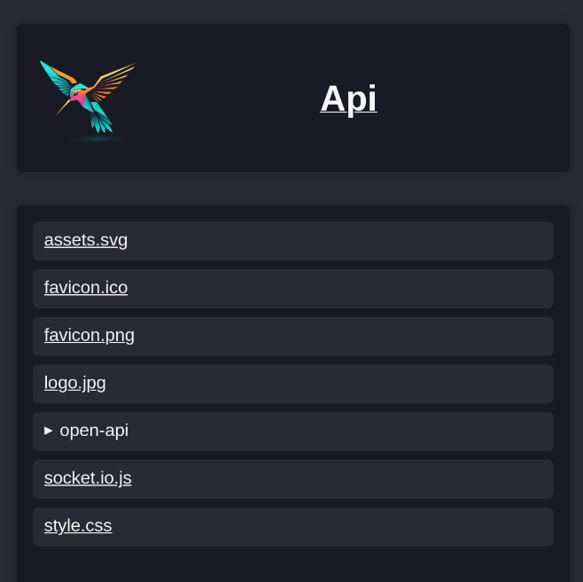

# Assets
Zibri offers a simple way to serve static files:

Anything you put under your projects assets folder will served under `/assets/{asset-name-with-file-ending}` (With the default configuration).

For documentation purposes there is also a simple "file explorer" page provided by Zibri under `/assets` when not specifying an asset, that can also be reached from the root page:

